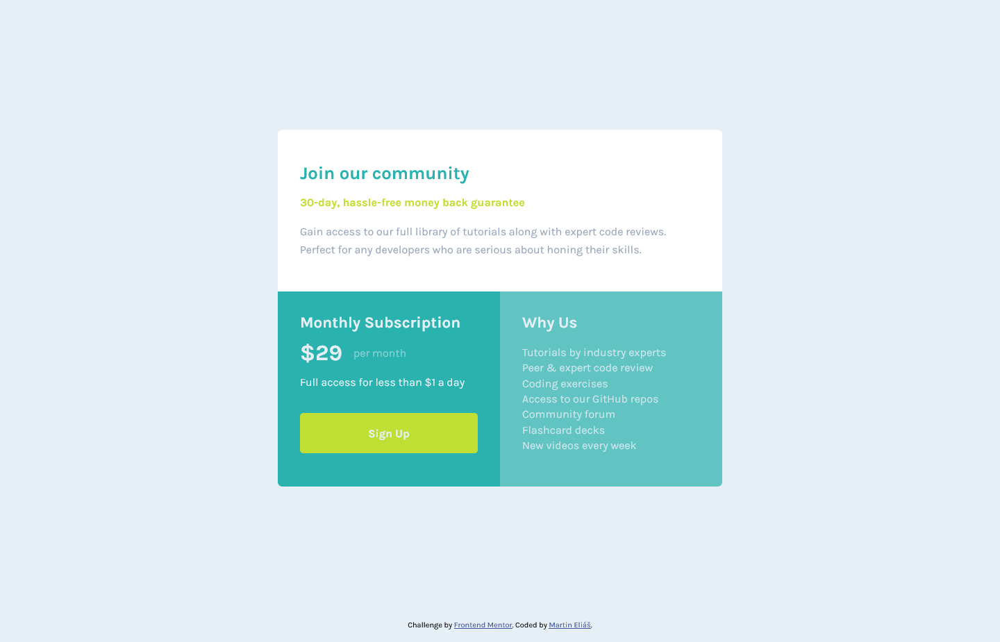

# Frontend Mentor - Single price grid component solution

This is a solution to the [Single price grid component challenge on Frontend Mentor](https://www.frontendmentor.io/challenges/single-price-grid-component-5ce41129d0ff452fec5abbbc). Frontend Mentor challenges help you improve your coding skills by building realistic projects. 

## Table of contents

- [Overview](#overview)
  - [The challenge](#the-challenge)
  - [Screenshot](#screenshot)
  - [Links](#links)
- [My process](#my-process)
  - [Built with](#built-with)
  - [Continued development](#continued-development)
- [Author](#author)

## Overview

### The challenge

Users should be able to:

- View the optimal layout for the component depending on their device's screen size
- See a hover state on desktop for the Sign Up call-to-action

### Screenshot

### Links

- Solution URL: [https://www.frontendmentor.io/solutions/responsive-single-price-component-with-css-grid-jKgkF6G94](https://www.frontendmentor.io/solutions/responsive-single-price-component-with-css-grid-jKgkF6G94)
- Live Site URL: [https://single-price-grid-component-master-lime-sigma.vercel.app/](https://single-price-grid-component-master-lime-sigma.vercel.app/)

## My process

### Built with

- Semantic HTML5 markup
- CSS custom properties
- CSS variables
- Flexbox
- CSS Grid
- Mobile-first workflow

### Continued development

I´ll continue to master CSS grid and flexbox layout system.

## Author

- LinkedIn - [Martin Eliáš](https://www.linkedin.com/in/martin-eli%C3%A1%C5%A1-455550209/)
- Frontend Mentor - [@smradupan](https://www.frontendmentor.io/profile/smradupan)
